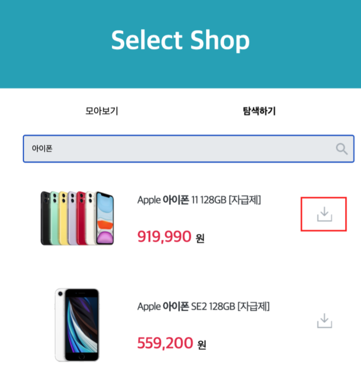

# 프로젝트명
> 네이버 검색 API를 사용해 관심있는 물건의 최저가를 알 수 있는 프로젝트입니다.

## Requirement
* Build: Gradle
* Language: Java 8
* Dependencies: 
  * Lombok
  * Spring Web
  * Spring Data JPA
  * H2 Database
  * MySQL Driver
  
## Usage
